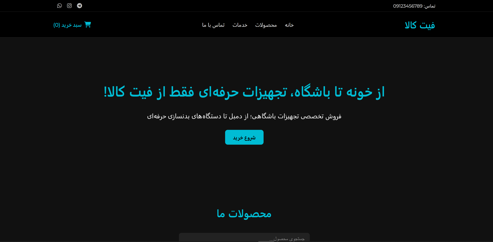
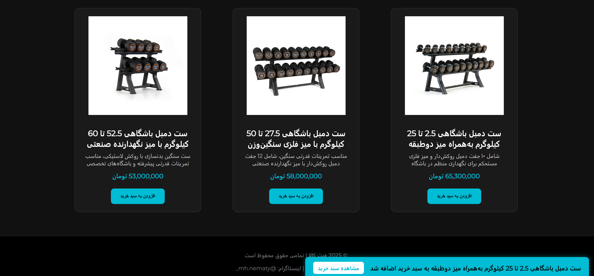
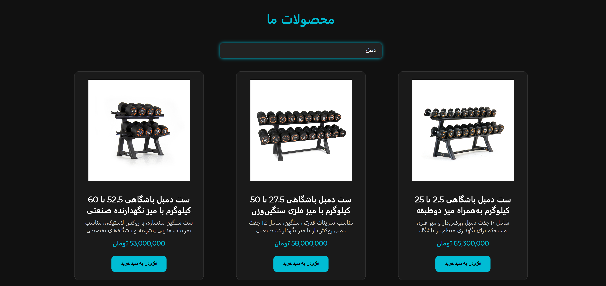
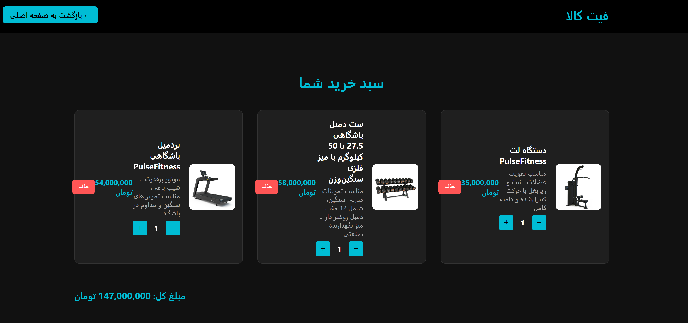
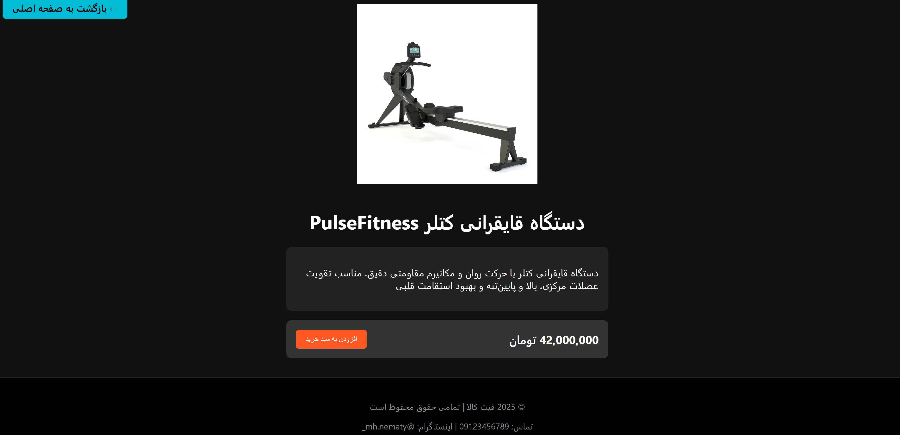

# 🏋️‍♂️ Fit-Kala







**فروشگاه آنلاین تجهیزات ورزشی** طراحی‌شده با HTML، CSS و JavaScript — با ذخیره‌سازی اطلاعات سبد خرید در LocalStorage و انتشار از طریق GitHub Pages

[🔗 مشاهده دمو آنلاین](https://mamadnematy.github.io/Fit-Kala/)

---

## 🛒 درباره پروژه

**Fit-Kala** یک پروژه فروشگاه اینترنتی ساده و سبک است که برای نمایش و فروش تجهیزات بدنسازی طراحی شده. این پروژه با تمرکز بر طراحی واکنش‌گرا، سادگی تجربه کاربر، و پیاده‌سازی بدون بک‌اند، امکان:

- نمایش محصولات ورزشی
- جستجوی محصولات
- افزودن و حذف از سبد خرید
- محاسبه مبلغ کل خرید
- ذخیره سبد خرید در حافظه مرورگر (LocalStorage)

را فراهم می‌کند.

---

## ⚙️ تکنولوژی‌های استفاده‌شده

- HTML5
- CSS3
- JavaScript
- LocalStorage
- Git + GitHub Pages

---

## 🚀 نحوه اجرا (Run Locally)

1. ابتدا مخزن را کلون کنید:

```bash
git clone https://github.com/mamadnematy/Fit-Kala.git
```

2. وارد پوشه پروژه شوید:

```bash
cd Fit-Kala
```

3. فایل `index.html` را با مرورگر باز کنید.

---

## 📬 ارتباط با توسعه‌دهنده

- 👤 **MamadNematy**
- 📧 **Email:** mamadhnematy@gmail.com
- 💬 **Telegram:** [@invincible_mamad](https://t.me/invincible_mamad)

---

## 📄 لایسنس

این پروژه تحت [MIT License](./LICENSE) منتشر شده است.

---

> طراحی‌شده با 💪 و علاقه توسط MamadNematy — 2025
